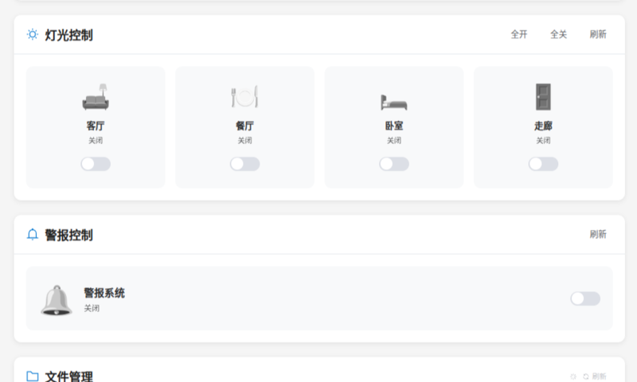

# Smart Home System - 嵌入式智能家居控制系统

   

`Smart_Home_System` 是一个功能全面、界面精美的嵌入式智能家居控制终端。本项目基于 GEC6818开发版，使用 C 语言和 LVGL 图形库构建，通过 MQTT 协议与云端及 Web 端实时同步，旨在为您提供一个集中、高效、智能的家居管理新体验

项目由两部分组成：

1.  **嵌入式主控终端 (Embedded Terminal)**：运行于嵌入式 Linux 设备，负责设备控制、UI 渲染和核心业务逻辑。

2.  **Web 控制端 (Web Control Panel)**：一个基于 Vue 和 TypeScript 的现代化 Web 应用，让您能随时随地远程控制您的家

    Web端使用[MQTT官方开源代码](https://github.com/emqx/MQTT-Client-Examples)修改而来

---

## 📸 界面展示

系统拥有基于 LVGL 精心设计的嵌入式 UI 和现代化的 Web 控制面板，两者界面清晰、操作直观、状态实时同步。

<table>
  <tr>
    <td align="center"><strong>主仪表盘 (Dashboard)</strong><br><em>实时天气、时间与快捷入口</em></td>
    <td align="center"><strong>安防系统 (Security)</strong><br><em>三种布防模式，一键报警</em></td>
  </tr>
  <tr>
    <td></td>
    <td></td>
  </tr>
  <tr>
    <td align="center"><strong>智能照明 (Lighting)</strong><br><em>多路灯光，亮度色温精细调节</em></td>
    <td align="center"><strong>影音娱乐 (Entertainment)</strong><br><em>集成图片、音乐、视频播放</em></td>
  </tr>
  <tr>
    <td></td>
    <td></td>
  </tr>
    <tr>
    <td align="center"><strong>AI 智能助手 (AI Assistant)</strong><br><em>集成 DeepSeek API，提供智能问答</em></td>
    <td align="center"><strong>Web 控制端 (Vue + TS)</strong><br><em>简洁高效的远程监控面板</em></td>
  </tr>
  <tr>
    <td></td>
    <td></td>
  </tr>
</table>

---

## ✨ 项目亮点

- **双端同步**：无论是通过嵌入式触摸屏还是 Web 端进行操作，设备状态都能通过 MQTT 协议在所有客户端之间实时同步，确保数据一致性。
- **跨平台构建**：借助 CMake 实现高度自动化配置，一套代码库可无缝编译于 Linux PC、ARM 嵌入式平台和 Windows，极大提升了开发和调试效率。
- **状态持久化**：关键设备状态（如灯光、安防模式）会被保存至本地文件系统，系统断电重启后可自动恢复，增强了系统的可靠性。
- **全功能集成**：不仅涵盖了照明、安防、环境控制等核心家居功能，还集成了影音娱乐和 AI 智能助手，打造一体化的智能生活中心。
- **现代化技术栈**：嵌入式端采用成熟的 C 语言与 LVGL，保证性能与稳定性；Web 端则采用 Vue 3 + TypeScript + Vite，带来流畅的开发与用户体验。

---

## 🏗️ 系统架构

本系统采用经典的“端-云-端”物联网架构，各部分职责清晰，分层解耦。

```
+------------------------+      +------------------+      +--------------------------+
|                        |      |                  |      |                          |
|  Web 控制端 (Vue+TS)   |<---->|   MQTT Broker    |<---->|   嵌入式主控终端 (C+LVGL)  |
| (Smt-Home-MQTT-Control)|      |  (Mosquitto/EMQX)|      |     (Smt_Home_System)    |
|                        |      |                  |      |                          |
+------------------------+      +------------------+      +--------------------------+
         (WebSocket/MQTT)            (TCP/MQTT)
```

### 嵌入式主控终端技术栈

- **核心语言**: C
- **构建系统**: CMake
- **UI 框架**: LVGL v8.2
- **网络通信**:
  - `paho-mqtt`: 实现 MQTT 客户端功能。
  - `libcurl`: 用于发起 HTTP 请求（获取天气、调用 AI API）。
- **数据解析**: `cJSON`
- **多线程**: Pthreads
- **媒体播放**: `mplayer` (视频), `madplay` (音频)

### Web 控制端技术栈

- **核心框架**: Vue.js (Vue 3)
- **开发语言**: TypeScript
- **构建工具**: Vite
- **MQTT 通信**: MQTT.js

---

## 🚀 快速开始

### 环境准备

- **硬件**: 适用于 Linux 的 PC、ARM 嵌入式开发板或 Windows PC。
- **软件**:
  - **嵌入式端**:
    - **Linux PC**: 安装 `build-essential`, `cmake`, `pkg-config` 及下文提到的开发库。
    - **ARM 交叉编译**: 准备好您的 ARM GCC 工具链。
    - **Windows**: 安装 MinGW 或 MSVC。
  - **Web 端**: 安装 Node.js 和 npm / pnpm / yarn。
  - **云端**: 一个正在运行的 MQTT Broker (如 Mosquitto 或 EMQX)。

### 编译与运行 (嵌入式主控终端)

1.  **克隆项目**
    ```bash
    git clone https://your-repo-url/Smart_Home_System.git
    cd Smart_Home_System
    ```

2.  **配置**
    在 `obj/Include/config.h` 文件中，填入您的 MQTT 服务器地址、天气 API Key 和 DeepSeek API Key。

3.  **编译**

    > 注意编译以前，你可能需要先安装依赖，往下翻可以看到需要哪些依赖

    ```bash
    mkdir -p build && cd build
    
    # 方式一: 本地 Linux PC 编译
    # (请先根据下方指引安装依赖)
    cmake ..
    
    # 方式二: ARM 交叉编译
    # (需在 arm.cmake 中配置好您的工具链路径)
    cmake .. -DCMAKE_TOOLCHAIN_FILE=../arm.cmake
    
    make -j$(nproc)
    ```

4.  **运行**
    可执行文件 `main` 将生成于 `bin` 目录下。
    ```bash
    cd ../bin
    ./main
    ```

### 运行 (Web 控制端)

1.  **进入目录**
    ```bash
    cd Smart-Home-MQTT-Control
    ```

2.  **安装依赖**
    ```bash
    npm install
    ```

3.  **配置**
    修改代码中的 MQTT 连接配置，使其指向您的 MQTT Broker 地址（注意使用 WebSocket 端口）。

4.  **启动**
    ```bash
    npm run dev
    ```
    在浏览器中打开提示的本地地址即可访问。

---

## 🛠️ 构建与依赖

本项目使用 CMake 作为构建系统，能够智能检测目标平台并自动配置 LVGL 驱动及相关依赖。

### 依赖项说明

#### 1. Linux (PC) 平台
在此模式下，项目依赖于系统已安装的动态库。
- **安装示例 (Debian / Ubuntu)**:
  ```bash
  sudo apt update
  sudo apt install build-essential cmake pkg-config \
       libsdl2-dev libfreetype6-dev libpng-dev zlib1g-dev \
       libssl-dev libcurl4-openssl-dev libmosquitto-dev libcjson-dev
  ```

#### 2. ARM 与 Windows 平台
为了方便交叉编译和 Windows 开发，这两个平台会**优先使用项目 `libs/` 目录下提供的预编译静态库**。您无需额外安装依赖，只需确保编译工具链可用。
- **注意**: Windows 模式默认仅链接 UI 相关库，主要用于界面开发调试，网络功能默认关闭。

### 自动化配置
`CMakeLists.txt` 会在编译前自动修改 LVGL 的配置文件 (`lv_conf.h` 等)，以适配不同平台：
- **PC/Windows**: 自动启用 SDL 驱动。
- **ARM**: 自动启用 Framebuffer (`FBDEV`) 和 `EVDEV` 驱动，以直接与屏幕和输入设备交互。

这个自动化过程确保了您无需手动修改 LVGL 配置即可在不同平台上无缝编译。

---

## 📂 目录结构

```
.
├── Smart-Home-MQTT-Control/ # Web 控制端 (Vue + TS)
├── arm.cmake                # ARM 交叉编译工具链文件
├── bin/                     # 存放可执行文件及运行时资源 (字体、媒体)
├── build/                   # 编译产物目录
├── data/                    # 存放持久化的设备状态文件
├── libs/                    # 第三方预编译静态库
├── lvgl/                    # LVGL 核心库
├── lv_drivers/              # LVGL 驱动
├── obj/                     # 项目 C 源码
│   ├── AI/                  # AI 聊天模块
│   ├── data/                # 数据持久化模块
│   ├── hardware/            # 硬件控制模块
│   ├── http/                # HTTP API 封装 (天气等)
│   ├── Include/             # 项目头文件
│   ├── MQTT/                # MQTT 通信模块
│   └── screen/              # LVGL 屏幕界面代码
├── CMakeLists.txt           # CMake 配置文件
├── main.c                   # 程序主入口
└── README.md                # 本文档
```